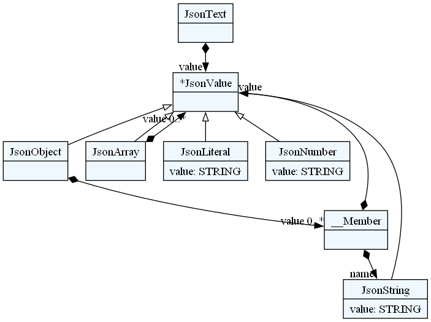
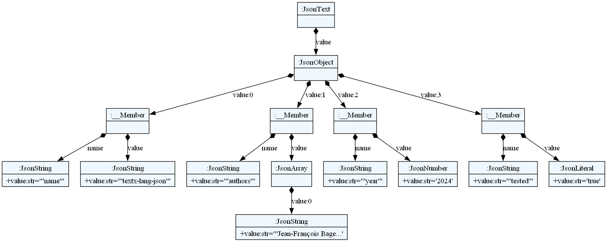

# textx-lang-json


**textx-lang-json** is a python implementation of the JSON (JavaScript Object Notation) data interchange format [RFC8259](https://www.rfc-editor.org/rfc/rfc8259) using the [textX](https://textx.github.io/textX/) meta-language. Though it is not intended to replace the standard python JSON encoder and decoder [Lib/json](https://docs.python.org/3/library/json.html), which is much faster, it is a good alternative when you want to mix some JSON in your own textX grammar, or a good starting point should you want to develop your own JSON-like grammar.

The `textxjson` package provides a parser (basically a *textX* *metamodel*), able to build a *textx* *model* from a JSON file or string. This model can be visualized, for educational purpose, but more importantly can be *decoded* to obtain the usual (as done by [Lib/json](https://docs.python.org/3/library/json.html)) python representation of the JSON document.

### Walkthrough

The following code demonstrates, in python, how to build a `parser`, generate a `model` from a python string respecting the JSON standard, and `decode` the model to obtain the usual python representation of the python string (in that case a dictionary). It also shows that `parser.model_from_str(data).decode()` returns the same python object as the standard `json.loads(data)`.

```python
from textx import metamodel_for_language

parser = metamodel_for_language('textxjson') # building the parser

data = '{"Hello": "World"}' # data is a python string respecting the JSON format
model = parser.model_from_str(data) # model is a JsonText object
textxresult = model.decode() # textxresult is a python dictionary

test1 = textxresult == {'Hello' : 'World'} # test1 is True

import json

jsonresult = json.loads(data) # using the standard python function to decode data

test2 = textxresult == jsonresult # test2 is True
```


## Installation

TO DO when registered on pip.

### Testing

```
python -m unittest
```
```
..............
----------------------------------------------------------------------
Ran 14 tests in 11.538s

OK
```


## Usage

### Building the parser

The first thing to do is to build the Json parser. This can be done with the following code.

```python
from textx import metamodel_for_language

parser = metamodel_for_language('textxjson')
```

#### Visualizing the grammar

```python
from textx.export import metamodel_export

metamodel_export(parser, 'json.dot')
```
This codes generates a file `json.dot` that can be visualized with [Graphviz](https://graphviz.org/), as shown below.



### Parsing a Json string

#### Visualizing the model




